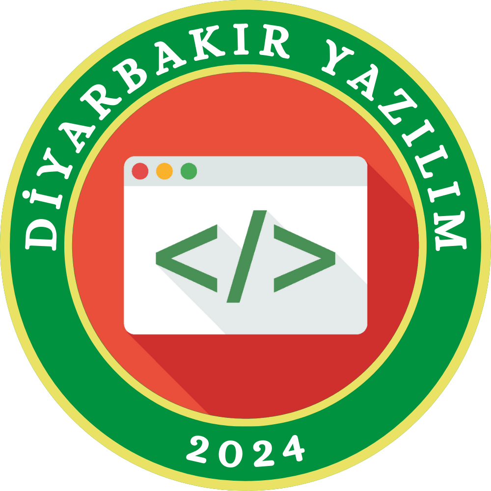

  

<h2 align="center">Diyarbakır Yazılım Topluluğu</h2>

## 🌟 Hakkında

Diyarbakır Yazılım Topluluğu, teknoloji meraklılarını bir araya getirmek, öğrenmeyi desteklemek ve iş birliğine dayalı bir açık kaynak ekosistemi oluşturmak amacıyla **Kasım 2024**'te kurulan, kâr amacı gütmeyen bir topluluktur.

## 💼 Burada Bulabilecekleriniz

- Açık kaynak topluluk projeleri
- Atölye ve etkinlik materyalleri
- Katkıda bulunma yönergeleri

## 🤝 Bize Katılın
Aşağıdaki kanallar aracılığıyla bizimle iletişime geçmekten veya topluluğumuza katılmaktan çekinmeyin:

🌐 [https://www.diyarbakiryazilim.org](https://www.diyarbakiryazilim.org)

📌 [LinkedIn](https://www.linkedin.com/company/diyarbakir-yazilim-toplulugu)

📌 [X / Twitter](https://x.com/diyaryazilim)

<!-- 📌 [Discord](https://discord.gg/diyarbakiryazilim) -->

📌 [Instagram](https://www.instagram.com/diyarbakiryazilim)

📌 [YouTube](https://www.youtube.com/@diyarbakiryazilim)
